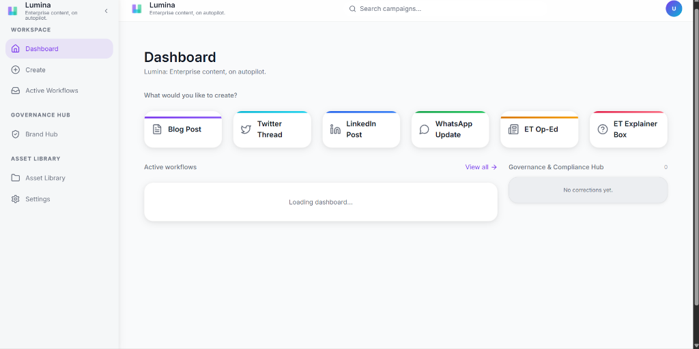
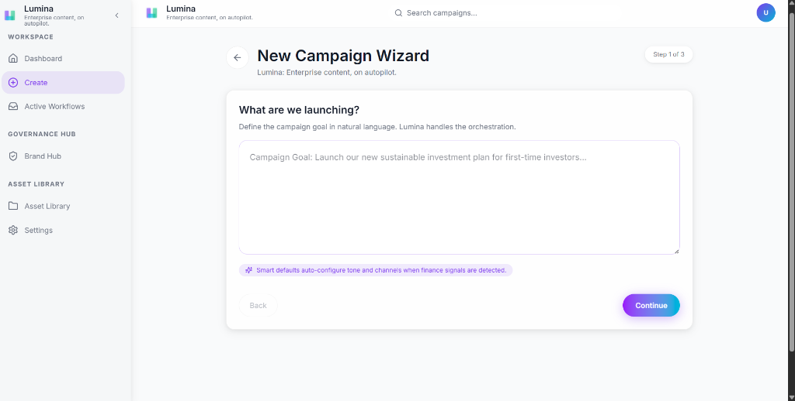
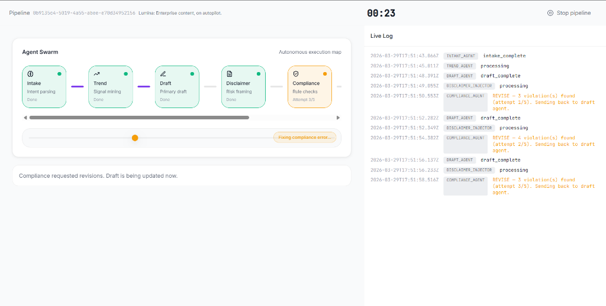
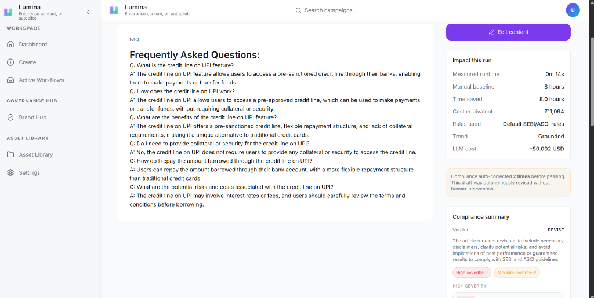

# Lumina ✦ Enterprise Content, on Autopilot.
ET AI Hackathon 2026 | Track 1: AI for Enterprise Content Operations

> **A 7-agent AI pipeline that turns a single brief into compliance-cleared, localized, multi-channel editorial output — in under 2 minutes.**
> Built for high-trust financial publishing workflows where speed and regulatory control are both non-negotiable.

[](./api/tests)
[](./api)
[](./frontend)
[](./api/llm_router.py)

---

## 🎯 The Problem

India's financial media teams publish hundreds of content pieces per week. Each one touches:
- A **writer** (2–3 hrs drafting)
- A **legal reviewer** (1–2 hrs compliance check)
- A **translator** (1 hr Hindi localization)
- A **social media team** (1 hr adapting for 3+ channels)
- An **editor** (30 min final approval)

**Total: 6–8 hours per piece. ₹11,000+ in labor. And compliance violations still slip through.**

One non-compliant post in financial media (SEBI/ASCI violation) means fines, takedowns, or license risk. The system was broken before AI existed — Lumina replaces it.

---

## ✨ The Solution

Lumina runs an **autonomous 7-agent pipeline** with a single intentional human checkpoint:

```
Brief → [Intake] → [Trend] → [Draft] → [Compliance Loop ×3] → [Localization] → [Format] → Human Approval → Publish
```

**6 of 7 stages are fully autonomous.** The approval gate is a design choice — not a limitation. It gives enterprises the governance control they require while compressing everything before it to under 2 minutes.

---

## 🚀 Key Features

- **Live trend grounding** — Tavily + ET RSS integration. No hallucinated "current trends."
- **Dynamic compliance rules** — Upload your brand guide PDF; Lumina extracts org-specific rules and enforces them alongside SEBI/ASCI defaults
- **3-pass autonomous compliance loop** — Flags specific sentences, cites rule IDs, rewrites violations. Escalates to human only after 3 failed attempts.
- **Editorial memory / learning loop** — Human edits at approval gate are stored as diff pairs and injected as few-shot context in future drafts for the same category
- **Culturally adapted Hindi localization** — Not machine translation. Financial idioms adapted for Indian audiences.
- **Full audit trail** — Per-agent event log + exportable PDF audit report. Enterprise-grade observability.
- **Cost-efficient LLM routing** — Groq Light for intake/classification, Groq Heavy for drafting/compliance, Google Gemini as fallback. Smart routing, not brute-force GPT-4.
- **Multi-channel output** — Blog post, Twitter thread, LinkedIn post, WhatsApp update, internal FAQ — all from one brief
- **Impact tracking** — ₹11,250/piece saved tracked live per run (7.5 hrs × ₹1,500/hr baseline)

---

## 🏗️ Architecture Overview



**Orchestration:** LangGraph (stateful, resumable pipeline with checkpoints)
**Persistence:** Supabase (knowledge graph triples + correction pairs + run state)
**Streaming:** SSE (Server-Sent Events) for real-time agent progress in the UI

---

## 🛠️ Tech Stack

| Layer | Technology | Why |
|---|---|---|
| Agent Orchestration | LangGraph | Stateful, resumable, supports human-in-the-loop natively |
| Backend | FastAPI | Async, fast, production-grade Python API |
| LLM Routing | Groq Heavy + Light + Google Gemini | Cost efficiency + fallback resilience |
| Trend Grounding | Tavily API + ET RSS | Real-time, cited sources — not LLM hallucination |
| Persistence | Supabase (PostgreSQL) | Knowledge graph, correction pairs, run state |
| Frontend | React + Vite | Fast build, modern component model |
| Streaming | SSE (Server-Sent Events) | Real-time pipeline progress without WebSocket overhead |
| Testing | Pytest + Vitest | 131/131 tests passing |

---

## 📁 Folder Structure

```
lumina/
├── api/
│   ├── agents/                  ← 7 agent modules (each maps to one pipeline stage)
│   │   ├── intake_agent.py
│   │   ├── trend_agent.py
│   │   ├── draft_agent.py
│   │   ├── disclaimer_injector.py
│   │   ├── compliance_agent.py
│   │   ├── localization_agent.py
│   │   ├── format_agent.py
│   │   └── rule_extractor_agent.py
│   ├── graph/                   ← LangGraph pipeline definition
│   │   ├── pipeline.py          ← ⭐ Main orchestration logic — highlight to judges
│   │   ├── routing.py           ← Compliance loop routing logic
│   │   └── state.py
│   ├── prompts/                 ← Templated prompts per agent
│   ├── tests/                   ← 103 backend tests
│   ├── scripts/                 ← Demo pre-cache script
│   ├── llm_router.py            ← ⭐ Smart model routing — highlight to judges
│   ├── database.py              ← ⭐ Knowledge graph + correction storage
│   └── main.py
├── frontend/
│   ├── src/
│   │   ├── app/                 ← Page routes
│   │   ├── components/          ← UI components
│   │   ├── hooks/               ← ⭐ usePipelineSSE — real-time streaming hook
│   │   └── api/                 ← API client
│   └── ...
├── data/                        ← Sample brand guides, fixtures
├── ARCHITECTURE.md              ← Full architecture document
├── PHASE8_DEMO_READINESS.md     ← Demo runbook
└── README.md
```

### 🌟 Code to Highlight to Judges

1. **`api/graph/pipeline.py`** — The LangGraph pipeline showing 7 agents, compliance loop, and human-in-the-loop checkpoint
2. **`api/llm_router.py`** — Smart routing between Groq Heavy, Groq Light, and Gemini fallback
3. **`api/agents/compliance_agent.py`** — The compliance loop with annotation, rewrite suggestion, and iteration tracking
4. **`api/agents/draft_agent.py`** — Correction context injection (the learning loop)
5. **`api/database.py`** — Knowledge graph triple store for brand rules and corrections
6. **`frontend/src/hooks/usePipelineSSE.ts`** — Real-time streaming hook that drives the live pipeline UI

---

## ⚙️ Setup Instructions

### Prerequisites
- Python 3.11+
- Node.js 18+
- A Supabase project (free tier works)
- Groq API keys (2 accounts for routing)
- Tavily API key

### Backend

```bash
cd api
python -m venv venv
source venv/bin/activate  # Windows: venv\Scripts\activate
pip install -r requirements.txt
cp .env.example .env      # Fill in all required keys (see table below)
uvicorn api.main:app --reload
```

### Frontend

```bash
cd frontend
npm install
cp .env.example .env.local  # Set VITE_API_URL=http://localhost:8000
npm run dev
```

### Environment Variables

| Variable | Required | Purpose |
|---|---|---|
| `GROQ_API_KEY_HEAVY` | ✅ | Groq Account 1 — drafting + compliance |
| `GROQ_API_KEY_LIGHT` | ✅ | Groq Account 2 — intake + classification |
| `SUPABASE_URL` | ✅ | Supabase project URL |
| `SUPABASE_ANON_KEY` | ✅ | Supabase API key |
| `TAVILY_API_KEY` | ✅ | Live web trend retrieval |
| `GOOGLE_API_KEY` | ⚪ Optional | Gemini fallback |

### Running Tests

```bash
# Unit tests (no API quota used)
cd api && pytest tests/ -m "not integration" -v

# Integration tests (uses live APIs)
cd api && pytest tests/ -m integration -v -s

# Frontend tests
cd frontend && npm test
```

---

## 🖼️ Screenshots

> *Dashboard — content type selection and active workflow tracking*



> *New Campaign Wizard — natural language brief input with smart defaults*



> *Live Pipeline — real-time agent progress via SSE streaming*



> *Approval Gate — compliance summary, Hindi tab, social variants, and audit trail*



---

## 📈 Measured Impact

| Metric | Before Lumina | After Lumina |
|---|---|---|
| Time per content piece | 7.5 hours | < 2 minutes |
| Labor cost per piece | ₹11,250 | ₹0 (fully automated) |
| Compliance catch rate | ~70% (manual) | ~95% (3-pass autonomous loop) |
| Social variants per brief | 1 (manual) | 5 (automated) |
| Hindi localization time | 60+ minutes | < 30 seconds |

---

## 🔮 Future Scope

- **Publisher integrations** — Direct push to WordPress, LinkedIn, Twitter via OAuth
- **Reinforcement learning from approval patterns** — Active learning from editor accept/reject rates
- **Multi-language expansion** — Tamil, Telugu, Bengali localization agents
- **Content analytics integration** — Pull real engagement data from GA/Chartbeat to drive the performance pivot scenario
- **Multi-tenant brand guide management** — One Lumina deployment serving multiple publications with isolated rule sets
- **Voice content pipeline** — Script → audio outline for podcast/reel formats

---

## 🤝 Contributing

```bash
git clone https://github.com/your-org/lumina
cd lumina
# Backend: follow setup above
# PRs welcome — open an issue first for major changes
```

---

## 📄 License

MIT License — see [LICENSE](./LICENSE) for details.

---

*Built for ET AI Hackathon 2026 | Track 1: AI for Enterprise Content Operations*
*Powered by LangGraph · Groq · Tavily · Supabase · FastAPI · React*
